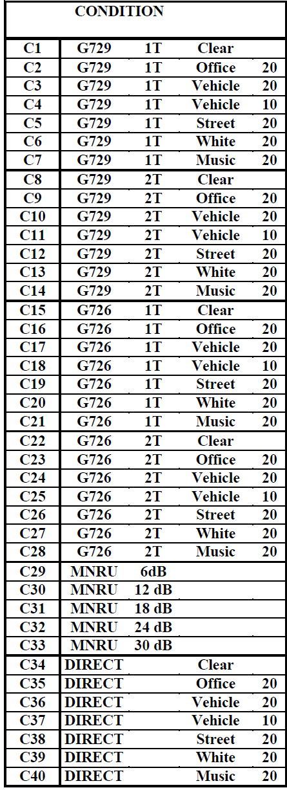

# Crowdsourced Speech Quality - CCR test method
Dataset of crowdsourced Speech Quality Assessment using the Comparison Category Rating (CCR) test method

Traditionally, _Quality of Experience_ (QoE) for a communication system is evaluated through a subjective test. 
The most common listening-only test method for speech QoE is the _Absolute Category Rating (ACR)_, in which participants listen to a set 
of stimuli, processed by the underlying test conditions, and rate their perceived quality for each stimulus on a 
specific scale. The _Comparison Category Rating (CCR)_ is another standard approach in which participants listen to both 
reference and processed stimuli and rate their quality compared to the other one. The CCR method is particularly 
suitable for systems that improve the quality of input speech.

Naderi et al. [1] evaluated an adaptation of the CCR test procedure for assessing speech quality in the crowdsourcing setup. 
The CCR method was introduced in the [ITU-T Rec. P.800](https://www.itu.int/rec/T-REC-P.800/en) for laboratory-based experiments. 
The test was adapted for the crowdsourcing approach following the guidelines from 
ITU-T Rec. [P.800](https://www.itu.int/rec/T-REC-P.800/en) and [P.808](https://www.itu.int/rec/T-REC-P.808/en). 
Results of multiple experiments we conducted, showed that the CCR procedure via crowdsourcing are highly reproducible. 

This repository contains the CCR ratings collected in those crowdsourcing tests.

## Citation
If you use this dataset in your research please cite it with the following reference.
The preprint is available here: [arXiv:2104.04371](https://arxiv.org/pdf/2104.04371.pdf) 

```BibTex
@inproceedings{naderi2021ccr,
  title={Speech Quality Assessment in Crowdsourcing: Comparison Category Rating Method},
  author={Naderi, Babak and M{\"o}ller, Sebastian and Cutler, Ross},
  booktitle={2021 Thirteen International Conference on Quality of Multimedia Experience (QoMEX)},
  pages={1--6},
  year={2021},
  organization={IEEE}
}
```

## Database Description:

Please check out the paper [1] for details about the experiments. 

  - **Experiment 1**: Here we compared results of CCR test in crowdsourcing with ACR test in laboratory and crowdsourcing. 
  Participants rated a dataset which previously was developed for standardization activities and ACR test method.  
  - **Experiment 2**: We used an openly available dataset from the [ITU-T Supplement 23](https://www.itu.int/rec/T-REC-P.Sup23-199802-I) 
  (Experiment2 dataset E) which was designed to evaluate the Terms of Reference for codec performance under conditions of environmental 
  background noise and background music using the CCR test method. We repeated the CCR test three times (hereafter runs)
   to demonstrate the reproducibility of our CCR test. 
   
We used the [P808 Toolkit](https://github.com/microsoft/P.808/) commit [ea45286](https://github.com/microsoft/P.808/commit/ea452866496d2b43ce32d7282b32b502356fb778) 
for collecting our data. This repository contains the accepted ratings from Experiment 2 (i.e. Exported by`result_parser` in long format).
Ratings are provided per file and per condition.


| CS Experiment | #Conditions | #User  | Avg. votes per cond. (C1-28/C29-40)| Min. votes per cond.(C1-28/C29-40) | Total #votes |
| ------------- |:-----------:| ------:|-----------------------------------:|-----------------------------------:|-------------:|
| run 1 | 40 | 56 |71 / 35| 61 / 31 | 2432 |
| run 2 | 40 | 61 |81 / 43 | 71 / 37| 2832 |
| run 3 | 40 | 46 |78 / 40|  70 / 35| 2688 |


### CSV Format

 * `runX_accepted_votes_long.csv`: Long format of accepted ratings in `run X`.
 * columns of te csv:
   * `HITId`: Set of clips that packed together got an ID. Each set was rated by a group of participants. Note the order 
   of presentation of clips in the set was randomized for each participant.
   * `workerid_hash`: participant's ID
   * `clip_name`: the audio clip name. See the ITU-T Sup23 Exp2 for details about naming 
   * `vote`: the vote given by participant (**corrected order** i.e. it shows the quality of processed one against the referenced one.)
   * `condition_num`: the condition number. List of condition numbers and their descriptions are given in ITU-T Sup23 Exp2.
     
   
### Conditions:
Here are the list of conditions used in the ITU Sup23 Experiment 2. Please refer to the original document for further details.



_source: ITU-T Sup23 Experiment 2 - Result , Table 3.2._ 
   
    
[1]. Naderi B., Möller S., Cutler R. (2021). _Speech Quality Assessment in Crowdsourcing: Comparison Category Rating Method_. In 2021 Thirteen International Conference on Quality of Multimedia Experience (QoMEX) (pp. 1-6). Preprint:[arXiv:2104.04371](https://arxiv.org/pdf/2104.04371.pdf)
  
## Copyright Notice:

MIT License

Copyright 2021 (c) Quality and Usability Lab, Technical University of Berlin.

Permission is hereby granted, free of charge, to any person obtaining a copy of this software and associated documentation files (the "Software"), to deal in the Software without restriction, including without limitation the rights to use, copy, modify, merge, publish, distribute, sublicense, and/or sell copies of the Software, and to permit persons to whom the Software is furnished to do so, subject to the following conditions:

The above copyright notice and this permission notice shall be included in all copies or substantial portions of the Software.

THE SOFTWARE IS PROVIDED "AS IS", WITHOUT WARRANTY OF ANY KIND, EXPRESS OR IMPLIED, INCLUDING BUT NOT LIMITED TO THE WARRANTIES OF MERCHANTABILITY, FITNESS FOR A PARTICULAR PURPOSE AND NONINFRINGEMENT. IN NO EVENT SHALL THE AUTHORS OR COPYRIGHT HOLDERS BE LIABLE FOR ANY CLAIM, DAMAGES OR OTHER LIABILITY, WHETHER IN AN ACTION OF CONTRACT, TORT OR OTHERWISE, ARISING FROM, OUT OF OR IN CONNECTION WITH THE SOFTWARE OR THE USE OR OTHER DEALINGS IN THE SOFTWARE.


